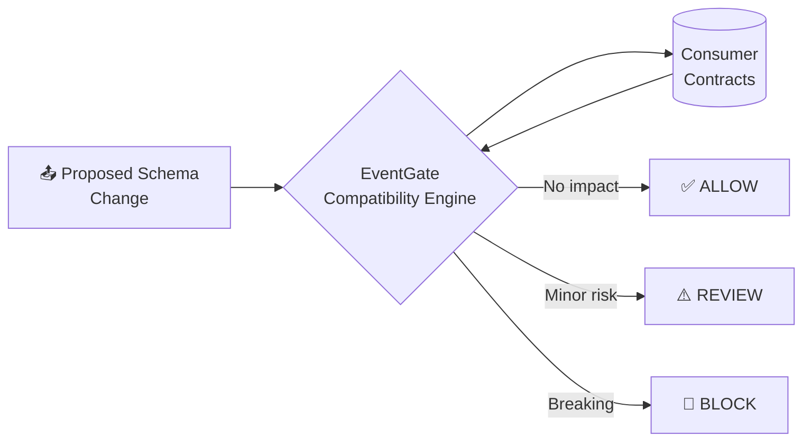

<div align="center">

# 🚪 PrimeX EventGate

### Consumer-Aware Safety Gate for Event-Driven Systems

*Stop breaking changes before they ever reach the event bus.*

[](https://www.python.org/)
[](https://fastapi.tiangolo.com/)
[](https://aws.amazon.com/serverless/sam/)
[](https://aws.amazon.com/dynamodb/)
[](LICENSE)
[]()

</div>

---

EventGate intercepts **schema changes** in event-driven architectures and deterministically predicts **downstream consumer impact** *before* deployment or event publishing. Instead of relying solely on producer-side schema validation, EventGate evaluates every proposed schema transition against **registered downstream consumer contracts** — so a "safe-looking" change on the producer side can never silently break a consumer three services away.

<div align="center">



</div>

---

## 📚 Table of Contents

- [Evolution: Phase 1 & Phase 2](#-evolution-phase-1--phase-2)
- [Architecture & Directory Structure](#️-architecture--directory-structure)
- [Dual Storage Modes](#-dual-storage-modes)
- [DynamoDB Data Model & Access Patterns](#-dynamodb-data-model--access-patterns)
- [Getting Started (Local Development)](#-getting-started-local-development)
- [AWS Deployment (Phase 2)](#️-aws-deployment-phase-2)
- [Golden Test Scenarios](#-golden-test-scenarios)
- [Current Limitations & Phase 3 Readiness](#-current-limitations--phase-3-readiness)
- [License](#-license)

---

## 🧭 Evolution: Phase 1 & Phase 2

| Phase | Focus | Key Additions |
|---|---|---|
| **🧱 Phase 1 — Foundation + Engine** | Pure decision logic | Deterministic compatibility engine · ChangeSet differ · Consumer contract scoping · Three-tier decision policy (`ALLOW` / `REVIEW` / `BLOCK`) · Local FastAPI · JSON-file contract repositories |
| **☁️ Phase 2 — Serverless AWS Runtime** | Cloud-native persistence | AWS SAM infra · Lambda (Python 3.14) via Mangum ASGI adapter · Amazon API Gateway HTTP API · DynamoDB persistence (`EventContractsTable` & `ConsumerContractsTable`) · Dual-mode storage (`local` ↔ `dynamodb`) · Zero-scan query access patterns |

> [!NOTE]
> **Boundary Notice (Phase 2):** Event transport (EventBridge), consumer worker Lambdas, and AI explanation features (Amazon Bedrock) are **future Phase 3 milestones** and are **not** implemented in Phase 2.

---

## 🏗️ Architecture & Directory Structure

Built on **Clean Architecture** principles — the domain layer is pure, cloud-agnostic Python with zero I/O.

```text
primex-eventgate/
├── backend/
│   ├── src/
│   │   ├── eventgate/
│   │   │   ├── api/                      # Presentation layer (FastAPI routers, DTO schemas)
│   │   │   │   ├── routes/               # Health and analysis endpoints
│   │   │   │   ├── dependencies.py       # Dual-storage backend dependency injection
│   │   │   │   └── errors.py             # Stable structured error response handlers
│   │   │   ├── application/              # Orchestration layer
│   │   │   │   ├── ports/                # Repository interface ports (IEventContractRepository, etc.)
│   │   │   │   └── services/             # EventAnalysisService
│   │   │   ├── domain/                   # Pure business logic (zero I/O, cloud-agnostic)
│   │   │   │   ├── changes.py            # ChangeSet computation
│   │   │   │   ├── compatibility.py      # Field-level & consumer-level rules engine
│   │   │   │   ├── decision.py           # Aggregate decision policy
│   │   │   │   ├── enums.py              # StrEnum status definitions
│   │   │   │   ├── errors.py             # Domain exception types
│   │   │   │   └── models.py             # Pure immutable dataclasses
│   │   │   ├── infrastructure/           # Persistence & adapters
│   │   │   │   └── repositories/         # Local JSON and DynamoDB repository adapters
│   │   │   ├── config/                   # Application settings & environment config
│   │   │   ├── lambda_handler.py         # Mangum ASGI adapter for AWS Lambda
│   │   │   └── main.py                   # FastAPI ASGI entrypoint
│   │   └── requirements.txt              # Lambda runtime dependencies for SAM packaging
│   └── tests/
│       ├── conftest.py                   # Shared fixtures & test builders
│       ├── unit/                         # Unit tests (models, rules, DynamoDB repos, equivalence)
│       └── integration/                  # End-to-end API and Lambda handler integration tests
├── contracts/                            # Versioned canonical contract fixtures (seed source)
│   ├── events/order-placed/              # v1, v2-safe, v3-breaking, v4-risk
│   └── consumers/                        # billing, inventory, analytics consumer contracts
├── docs/                                 # Architecture & deployment specifications
│   ├── architecture.md                   # Phase 1 Clean Architecture guide
│   ├── aws-architecture.md               # Phase 2 AWS serverless topology & DynamoDB model
│   └── deployment.md                     # Step-by-step AWS deployment & verification guide
├── events/                                # API Gateway HTTP API v2 sample test events
├── scripts/
│   ├── local_demo.py                     # Local demonstration of golden scenarios
│   ├── seed_dynamodb.py                  # Idempotent DynamoDB seeding script
│   └── aws_smoke_test.py                 # Live AWS API Gateway smoke test script
├── template.yaml                          # AWS SAM CloudFormation template
├── samconfig.toml                         # Non-secret SAM deployment configuration
└── pyproject.toml                         # Build configuration, Ruff, Pytest & coverage settings
```

---

## 💾 Dual Storage Modes

EventGate supports two interchangeable persistence backends via `EVENTGATE_STORAGE_BACKEND` — **the application service and deterministic compatibility engine stay identical across both.**

| Mode | Env Variable | Backend | Description |
|---|---|---|---|
| 🖥️ **Local** | `EVENTGATE_STORAGE_BACKEND=local` | `contracts/*.json` | Zero-cloud local development and fast CI testing |
| ☁️ **AWS / Cloud** | `EVENTGATE_STORAGE_BACKEND=dynamodb` | Amazon DynamoDB | `GetItem` / `Query` on GSI index — zero table scans |

---

## 🗂️ DynamoDB Data Model & Access Patterns

<table>
<tr><td>

**`EventContractsTable`**
- **HASH:** `eventType` (String)
- **RANGE:** `version` (Number)
- **Billing:** `PAY_PER_REQUEST`
- **Access:** `GetItem(eventType, version)`, `Query(eventType)` — zero scans

</td><td>

**`ConsumerContractsTable`**
- **HASH:** `consumerId` (String)
- **GSI `EventTypeIndex`:** HASH `eventType`, RANGE `consumerId`
- **Billing:** `PAY_PER_REQUEST`
- **Access:** `GetItem(consumerId)`, `Query(EventTypeIndex, eventType)` — zero scans

</td></tr>
</table>

---

## 🚀 Getting Started (Local Development)

<details open>
<summary><strong>1. Installation</strong></summary>

```powershell
python -m venv .venv
.\.venv\Scripts\Activate.ps1
pip install -e ".[dev]"
```
</details>

<details>
<summary><strong>2. Run Tests & Coverage</strong></summary>

```powershell
pytest --cov=eventgate --cov-report=term-missing
```
</details>

<details>
<summary><strong>3. Code Quality & Format Checks</strong></summary>

```powershell
ruff check .
ruff format --check .
pip check
```
</details>

<details>
<summary><strong>4. Run the Local Demonstration</strong></summary>

```powershell
python scripts/local_demo.py
```
</details>

<details>
<summary><strong>5. Run Local API Server</strong></summary>

```powershell
uvicorn eventgate.main:app --host 0.0.0.0 --port 8000 --reload
```
</details>

---

## ☁️ AWS Deployment (Phase 2)

📖 Full documentation: [`docs/deployment.md`](docs/deployment.md)

**Prerequisites**
- ✅ AWS CLI configured with appropriate IAM credentials (`aws sts get-caller-identity`)
- ✅ AWS SAM CLI (`sam`)
- ✅ Docker daemon running (for local container emulation)

**Quick Deployment Steps**

```powershell
# 1. Validate SAM template
sam validate --lint

# 2. Build deployment package
sam build

# 3. Deploy to AWS
sam deploy

# 4. Seed DynamoDB tables with canonical contracts
python scripts/seed_dynamodb.py `
  --event-table primex-eventgate-dev-event-contracts `
  --consumer-table primex-eventgate-dev-consumer-contracts

# 5. Run smoke tests against the deployed API Gateway URL
python scripts/aws_smoke_test.py https://ux8bwi3i8l.execute-api.ap-south-1.amazonaws.com
```

---

## 🧪 Golden Test Scenarios

EventGate deterministically evaluates schema transitions across **both** local and AWS runtimes:

| Scenario | Transition | Key Change | Consumer Findings | Decision | Severity |
|---|---|---|---|:---:|:---:|
| **A** | v1 → v2 | Added optional `metadata` | All consumers SAFE (`EVT005`) | ✅ `ALLOW` | 🟢 `LOW` |
| **B** | v1 → v3 | `shippingMethod` → `object` | `inventory-service` BREAK (`EVT001`), others SAFE (`EVT008`) | 🚫 `BLOCK` | 🔴 `HIGH` |
| **C** | v1 → v4 | Removed optional `couponCode` | `analytics-service` RISK (`EVT006`), others SAFE (`EVT008`) | ⚠️ `REVIEW` | 🟡 `MEDIUM` |

---

## 🔭 Current Limitations & Phase 3 Readiness

**Current Limitations**
- Consumer contracts are seeded rather than dynamically registered via an admin API
- Authentication (Cognito/API Key) and a web frontend are not included in Phase 2

**Phase 3 Readiness** — the deployed serverless API and DynamoDB persistence already provide the foundation for:
- 🔗 Connecting `ALLOW` decisions to EventBridge event bus publication
- 🛑 Rejecting `BLOCK` decisions at the gateway before publishing
- ⚙️ Deploying consumer worker Lambdas (`Billing`, `Inventory`, `Analytics`) subscribed to the EventBridge bus

---

## 📄 License

This project is licensed under the **MIT License** — see the [LICENSE](LICENSE) file for details.

<div align="center">

---

*Built for the AWS "First Commit" hackathon — Bharat Builds Tour by WeMakeDevs* 🇮🇳

</div>
