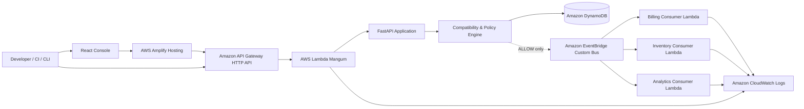

# PrimeX EventGate

Consumer-aware event contract release gate for event-driven systems.

> **"You changed one thing. We tell you what breaks before it breaks."**

`Python` · `FastAPI` · `React` · `TypeScript` · `AWS Lambda` · `Amazon API Gateway` · `Amazon DynamoDB` · `Amazon EventBridge` · `AWS Amplify` · `AWS SAM`

---

## Live Endpoints

| Interface | URL | Deployment Stack | Hosting |
| :--- | :--- | :--- | :--- |
| **Control Console** | [https://main.d1etyxeqf0w3wz.amplifyapp.com](https://main.d1etyxeqf0w3wz.amplifyapp.com) | Continuous deployment from `main` | AWS Amplify |
| **Enforcement API** | [https://ux8bwi3i8l.execute-api.ap-south-1.amazonaws.com](https://ux8bwi3i8l.execute-api.ap-south-1.amazonaws.com) | `primex-eventgate-dev` (`ap-south-1`) | Amazon API Gateway + AWS Lambda |

---

## Problem

In event-driven microservices, producers evolve schemas independently. When a producer modifies an event contract, traditional schema validation checks only whether the published JSON payload matches the producer's own schema definition. It does not cross-reference downstream consumer dependencies.

### Concrete Example

Consider the `OrderPlaced` event in an e-commerce platform:

**Current Contract (v1):**
```json
{
  "orderId": { "type": "string", "required": true },
  "customerId": { "type": "string", "required": true },
  "amount": { "type": "number", "required": true },
  "shippingMethod": { "type": "string", "required": true }
}
```

**Proposed Contract (v3):**
```json
{
  "orderId": { "type": "string", "required": true },
  "customerId": { "type": "string", "required": true },
  "amount": { "type": "number", "required": true },
  "shippingMethod": { "type": "object", "required": true }
}
```

A downstream service, `inventory-service`, relies upon `shippingMethod` being a flat `string` to route warehouse shipments:
```json
{
  "consumerId": "inventory-service",
  "dependencies": {
    "OrderPlaced": {
      "requiredFields": ["orderId", "shippingMethod"],
      "fieldTypes": { "shippingMethod": "string" }
    }
  }
}
```

Without a release gate:
1. The producer validates its payload against its own v3 schema (valid).
2. The event is published to the message broker.
3. `inventory-service` encounters a runtime deserialization error or type exception (`expected string, received object`), failing order fulfillment in production.

**The Core Distinction:**
Standard schema validation answers: *"Is this payload valid according to the producer's schema?"*
PrimeX EventGate answers: *"Which declared consumers are affected by this change, and what should happen to the release in this environment?"*

---

## What EventGate Does

1. **Loads Contracts:** Retrieves current and proposed event contract definitions alongside registered downstream consumer dependency contracts.
2. **Computes Structural Diff:** Determines added fields, removed fields, type modifications, and requiredness transitions.
3. **Checks Consumer Dependencies:** Scopes impact to declared consumer contracts. Consumers with no dependency on changed fields remain unaffected.
4. **Produces Compatibility Result:** Evaluates deterministic rules (`EVT001` through `EVT008`) to classify compatibility as `SAFE`, `RISK`, or `BREAK`.
5. **Calculates Severity:** Maps rule findings to `LOW`, `MEDIUM`, or `HIGH` severity.
6. **Applies Environment Policy:** Evaluates the target environment policy (`production`, `staging`, or `development`).
7. **Issues Release Decision:** Emits an authoritative release action: `ALLOW`, `REVIEW`, or `BLOCK`.
8. **Enforces Gated Publication:** Calls `events:PutEvents` on Amazon EventBridge only when the decision is `ALLOW`. For `BLOCK` or `REVIEW`, publication is halted before broker ingress.
9. **Records Release History:** Stores an immutable, correlated release record linking pre-flight analysis ID, request ID, policy result, and broker event ID for auditability.

---

## Core Decision Model

EventGate maintains a strict two-level decision model:

```text
┌─────────────────────────────────────────────────────────────┐
│                 COMPATIBILITY EVALUATION                    │
│          "What is the technical impact of the change?"      │
│                                                             │
│   Status:   SAFE    │    RISK          │    BREAK           │
│   Severity: LOW     │    MEDIUM        │    HIGH            │
└──────────────────────────────┬──────────────────────────────┘
                               │
                               ▼
┌─────────────────────────────────────────────────────────────┐
│                  ENVIRONMENT RELEASE POLICY                 │
│         "Given the impact and environment, what action?"    │
│                                                             │
│   Decision: ALLOW   │    REVIEW        │    BLOCK           │
│   Action:   Permit  │    Hold for ops  │    Prevent         │
└─────────────────────────────────────────────────────────────┘
```

> **"Compatibility describes the impact of the change. Release policy determines the action for the target environment."**

Compatibility analysis is an objective, deterministic evaluation of schema deltas against declared consumer dependencies. Release policy translates that evaluation into an operational decision based on the risk tolerance of the target environment.

---

## Example Scenarios

The repository includes canonical test scenarios using the `OrderPlaced` contract fixture:

| Scenario | Transition | Compatibility | Severity | Policy (Production) | Policy (Development) | Publication Action |
| :--- | :--- | :---: | :---: | :---: | :---: | :--- |
| **Safe Evolution** | v1 $\to$ v2 (Adds optional `metadata`) | `SAFE` | `LOW` | **`ALLOW`** | **`ALLOW`** | **Permitted.** Published to EventBridge. All downstream consumers invoked. |
| **Breaking Evolution** | v1 $\to$ v3 (`shippingMethod`: `string` $\to$ `object`) | `BREAK` | `HIGH` | **`BLOCK`** | **`BLOCK`** | **Prevented.** HTTP 409 returned. Zero broker publish. Consumers never reached. |
| **Risky Removal** | v1 $\to$ v4 (Removes optional `couponCode`) | `RISK` | `MEDIUM` | **`REVIEW`** | **`ALLOW`** *(with warning)* | In production: **Held.** HTTP 409 returned pending review. In development: permitted with warning notice. |

---

## Architecture



*Note: Amazon EventBridge is reached only when the release decision is `ALLOW`.*

---

## AWS Services

| Service | Identifier / Resource | Purpose in EventGate |
| :--- | :--- | :--- |
| **AWS Amplify** | `main.d1etyxeqf0w3wz.amplifyapp.com` | Continuous deployment hosting for the single-page React management console |
| **Amazon API Gateway** | `ux8bwi3i8l.execute-api.ap-south-1.amazonaws.com` | HTTP API (v2) entry point providing low-latency routing and CORS configuration |
| **AWS Lambda** | `primex-eventgate-dev-api` | Python 3.14 compute executing the FastAPI service layer via Mangum |
| **Amazon DynamoDB** | `primex-eventgate-dev-event-contracts`<br/>`primex-eventgate-dev-consumer-contracts`<br/>`primex-eventgate-dev-release-history` | On-demand key-value and query storage for contracts, consumers, and release audit records |
| **Amazon EventBridge** | `primex-eventgate-dev-bus` | Custom event bus routing approved events to registered downstream microservices |
| **Amazon CloudWatch** | `/aws/lambda/primex-eventgate-dev-*` | Structured runtime log groups for request tracking and consumer invocation verification |
| **AWS IAM** | Scoped execution roles | Least-privilege IAM policies restricting Lambda to specific table ARNs and bus ARN |
| **AWS SAM** | `template.yaml` | Declarative CloudFormation specification defining serverless resources, parameters, and outputs |

---

## Backend Architecture

EventGate's backend (`backend/src/eventgate`) follows clean hexagonal architecture:

* **Presentation Layer (`eventgate.api`):** FastAPI application wrapped with Mangum for AWS Lambda. Exposes REST routes, injects request correlation IDs (`X-Request-ID`), validates request payloads, and formats domain exceptions into uniform error envelopes.
* **Application Layer (`eventgate.application`):** Orchestrates use cases via dedicated services:
  * `EventAnalysisService`: Loads contracts, runs diffing, invokes compatibility evaluation, executes policy, and returns analysis results.
  * `GatedEventPublishService`: Validates event payload syntax, enforces policy decision, invokes the event publisher on `ALLOW`, and persists the correlated release record.
  * `ContractCatalogService`: Serves event contract versions and consumer dependency details with zero-scan caching.
  * `ReleaseHistoryService`: Manages retrieval of persistent release audit records.
  * `ReportExportService`: Deterministically generates Markdown and JSON compliance reports.
* **Domain Layer (`eventgate.domain`):** Pure Python domain models implemented as frozen dataclasses. Contains zero third-party framework or cloud SDK imports. Includes the `CompatibilityEngine`, type widening matrix, decision aggregation logic, and policy port abstractions (`IPolicyEngine`).
* **Infrastructure Layer (`eventgate.infrastructure`):** Pluggable repository adapters (`JsonEventContractRepository`, `DynamoEventContractRepository`, `JsonReleaseReviewRepository`, `DynamoReleaseReviewRepository`) and publisher adapters (`LocalEventPublisher`, `EventBridgePublisher`).

---

## Compatibility Rules

The `CompatibilityEngine` evaluates structural schema differences using 8 deterministic rules with an explicit precedence hierarchy:

| Precedence | Rule ID | Description | Default Status | Severity |
| :---: | :--- | :--- | :---: | :---: |
| **1** | `EVT001_FIELD_TYPE_CHANGED` | Incompatible type transition on a field consumed by a downstream service | `BREAK` | `HIGH` |
| **2** | `EVT003_CONSUMER_REQUIRED_FIELD_MISSING` | Field required by a consumer contract is missing from the proposed event | `BREAK` | `HIGH` |
| **3** | `EVT002_REQUIRED_FIELD_REMOVED` | Producer removed a field that was required in the current contract | `BREAK` | `HIGH` |
| **4** | `EVT004_REQUIREDNESS_CHANGED` | Field requiredness changed (required to optional or vice versa) | `RISK` / `BREAK` | `MEDIUM` / `HIGH` |
| **5** | `EVT007_UNSUPPORTED_CHANGE` | Schema change that falls outside supported deterministic transitions | `BREAK` | `HIGH` |
| **6** | `EVT006_OPTIONAL_FIELD_REMOVED` | Optional field removed that a downstream consumer declared as an optional dependency | `RISK` | `MEDIUM` |
| **7** | `EVT005_OPTIONAL_FIELD_ADDED` | Optional field added to the proposed event; consumers unaffected | `SAFE` | `LOW` |
| **8** | `EVT008_CONSUMER_UNAFFECTED` | Downstream consumer does not depend on any modified fields | `SAFE` | `LOW` |

### Empty Consumer Set Policy
When an event contract change is evaluated for an event type with zero registered consumer contracts, the platform does not assume safety. `aggregate_decision()` evaluates empty consumer sets to:
* Compatibility: `RISK`
* Severity: `MEDIUM`
* Decision: `REVIEW`
* Summary: *"No registered consumers were found for this event type. Compatibility cannot be fully verified."*

---

## Release Policy

EventGate supports pluggable policy providers:
1. **`standard` (`StandardReleasePolicyEngine`):** Pure deterministic Python implementation.
2. **`cedar` (`CedarReleasePolicyEngine`):** Formal AWS Cedar policy specifications evaluated via `cedarpy` against `contracts/policies/release_policy.cedar`.

### Environment Policy Matrix

| Environment | LOW Severity (`SAFE`) | MEDIUM Severity (`RISK`) | HIGH Severity (`BREAK`) |
| :--- | :---: | :---: | :---: |
| **`production`** | **`ALLOW`** | **`REVIEW`** | **`BLOCK`** |
| **`staging`** | **`ALLOW`** | **`REVIEW`** | **`BLOCK`** |
| **`development`** | **`ALLOW`** | **`ALLOW`** *(with warning)* | **`BLOCK`** |

---

## API Reference

The API is fully documented in [docs/api.md](docs/api.md). Every endpoint includes request correlation via `X-Request-ID`.

### Endpoints

| Method | Path | Purpose | Success Status |
| :--- | :--- | :--- | :---: |
| `GET` | `/health` | Service health and runtime status probe | `200 OK` |
| `POST` | `/api/v1/analyze` | Evaluates contract diff against consumers and returns release decision | `200 OK` |
| `POST` | `/api/v1/events/publish` | Enforces release policy and publishes event payload to EventBridge if allowed | `200 OK` / `409 Conflict` |
| `GET` | `/api/v1/contracts/events` | Lists all registered event types and available versions | `200 OK` |
| `GET` | `/api/v1/contracts/events/{eventType}` | Returns all versioned schemas for a specific event type | `200 OK` |
| `GET` | `/api/v1/contracts/consumers` | Lists all registered consumer services and their subscriptions | `200 OK` |
| `GET` | `/api/v1/contracts/consumers/{consumerId}`| Returns dependency details and field requirements for a consumer | `200 OK` |
| `GET` | `/api/v1/history` | Returns paginated release audit history records | `200 OK` |
| `GET` | `/api/v1/history/{record_id}` | Retrieves a single release audit record by ID | `200 OK` |
| `GET` | `/api/v1/history/{record_id}/report` | Generates a Markdown or JSON compliance report for a release record | `200 OK` |
| `POST` | `/api/v1/reports/export` | Exports batch compliance reports in Markdown or JSON format | `200 OK` |
| `GET` | `/api/v1/policies` | Returns active policy engine status, matrix, and Cedar policy source | `200 OK` |
| `GET` | `/api/v1/config/runtime` | Returns authoritative runtime configuration and active adapters | `200 OK` |

### Example: Analyze Request
```http
POST /api/v1/analyze HTTP/1.1
Host: ux8bwi3i8l.execute-api.ap-south-1.amazonaws.com
Content-Type: application/json

{
  "eventType": "OrderPlaced",
  "currentVersion": 1,
  "proposedVersion": 3,
  "environment": "production"
}
```

### Example: Analyze Response
```json
{
  "analysisId": "7c18b762-6f29-411a-a53c-f86a98da5f81",
  "eventType": "OrderPlaced",
  "currentVersion": 1,
  "proposedVersion": 3,
  "compatibilityResult": "BREAK",
  "severity": "HIGH",
  "decision": "BLOCK",
  "summary": "The proposed event is incompatible with 1 registered consumer.",
  "environment": "production",
  "policyName": "StandardReleasePolicy",
  "policyReason": "Release policy for 'production' strictly blocks breaking changes (1 high-severity break detected).",
  "warnings": [],
  "findings": [
    {
      "consumerId": "inventory-service",
      "field": "shippingMethod",
      "status": "BREAK",
      "severity": "HIGH",
      "ruleId": "EVT001_FIELD_TYPE_CHANGED",
      "description": "Field 'shippingMethod' type changed from string to object, which is incompatible with inventory-service."
    }
  ],
  "timestamp": "2026-09-20T07:30:00.000000Z",
  "requestId": "req-9c82a1"
}
```

### Error Envelope
Domain and validation failures return a structured error envelope:
```json
{
  "error": {
    "code": "EVENT_PUBLISH_BLOCKED",
    "message": "Event publication was blocked or held pending review.",
    "details": {
      "decision": "BLOCK",
      "severity": "HIGH"
    },
    "requestId": "req-9c82a1"
  }
}
```

---

## Frontend Control Plane

The web console (`frontend/`) provides an engineering control plane:

* **Review Workspace:** 3-column layout featuring event selector, line-numbered JSON payload editor, inline schema diagnostics, interactive blast radius topology graph, and PR-style schema diff.
* **Decision Hero:** Status indicator displaying Compatibility Status (`SAFE` / `RISK` / `BREAK`), Severity (`LOW` / `MEDIUM` / `HIGH`), and Release Decision (`ALLOW` / `REVIEW` / `BLOCK`).
* **Consumer Impact Panel:** Clear breakdown of affected vs unaffected downstream consumer services with specific field-level rule violations.
* **Event Path Pipeline:** Step-by-step pipeline view tracing payload validation $\to$ structural diff $\to$ consumer impact $\to$ policy evaluation $\to$ EventBridge ingress.
* **Contract Registry & Consumer Explorer:** Searchable catalogs of versioned schemas and consumer dependency subscriptions.
* **Release History & Report Export:** Persistent audit log linking analysis records to publication outcomes with one-click export to Markdown or JSON compliance reports.
* **Policy Inspector:** Interactive matrix viewer across environments with read-only inspection of formal AWS Cedar policy specifications.
* **Developer Tools:** Live assertion runner comparing expected vs actual gate decisions, CLI generator, and CI integration guide.
* **Command Palette:** Fast keyboard navigation accessible via `Ctrl+K` / `Cmd+K`.

---

## Local Development

EventGate is designed for zero-credential local development without cloud dependencies.

### Conceptual Local Path
```text
Frontend (Vite / React)
        ↓
FastAPI Application (Uvicorn on port 8000)
        ↓
EventGate Domain Engine (CompatibilityEngine)
        ↓
Local JSON Repositories (contracts/events/, contracts/consumers/)
        ↓
LocalEventPublisher (In-memory publication sink)
```

The core domain logic is entirely independent of AWS SDKs and cloud services.

### Local Setup Instructions

```powershell
# 1. Clone repository
git clone https://github.com/pratyushkandari/primex-eventgate.git
cd primex-eventgate

# 2. Set up Python virtual environment
python -m venv .venv
.\.venv\Scripts\Activate.ps1
pip install -r backend/src/requirements.txt
pip install pytest pytest-cov ruff uvicorn

# 3. Start local backend server
$env:PYTHONPATH="backend/src"
python -m uvicorn eventgate.main:app --port 8000 --reload

# 4. Verify local health check
Invoke-RestMethod -Uri "http://127.0.0.1:8000/health" -Method GET
# Returns: {"status": "ok", "service": "eventgate", "version": "0.1.0"}

# 5. Start local frontend console (in a separate terminal)
cd frontend
npm install
npm run dev
# Open http://localhost:5173
```

---

## AWS SAM Local Execution

The repository provides a complete AWS Serverless Application Model specification in `template.yaml`.

### Validating and Building Infrastructure
```powershell
# Validate SAM template syntax and linting rules
sam validate -t template.yaml --lint

# Build serverless deployment artifacts into .aws-sam/build
sam build
```

### SAM Local Emulation Note
AWS SAM CLI uses Docker to emulate AWS Lambda and API Gateway locally (`sam local start-api` or `sam local invoke`). Running SAM local emulation requires an active Docker daemon. When a Docker daemon is not running on the host system, developers can use EventGate's native FastAPI local server (`uvicorn eventgate.main:app`), which executes the identical application code and domain logic without container overhead.

---

## Cloud Deployment

The live cloud infrastructure is deployed in **AWS Region `ap-south-1` (Mumbai)**.

### Target Environment vs Runtime Stack

It is important to distinguish the **logical release target** from the **physical infrastructure stack**:

* **Release Target (`production` / `staging` / `development`):** The logical governance context supplied in API requests and CLI commands. Governs which release policy rules are evaluated (e.g. `production` blocks medium-risk changes while `development` allows them with a warning).
* **Runtime Infrastructure Stack (`primex-eventgate-dev`):** The physical AWS CloudFormation stack deployed in AWS `ap-south-1`. Contains the Lambda function, API Gateway HTTP API, three DynamoDB tables, and custom EventBridge bus.

### Deployment Process

```powershell
# 1. Validate template
sam validate -t template.yaml --lint

# 2. Build deployment package
sam build

# 3. Deploy via committed samconfig.toml (or guided on first run)
sam deploy

# 4. Seed DynamoDB tables with canonical contracts
python scripts/seed_dynamodb.py `
  --event-table primex-eventgate-dev-event-contracts `
  --consumer-table primex-eventgate-dev-consumer-contracts `
  --region ap-south-1 `
  --contracts-dir contracts

# 5. Verify live deployment
python scripts/aws_smoke_test.py https://ux8bwi3i8l.execute-api.ap-south-1.amazonaws.com
```

---

## Data Model

EventGate models three core entities in Amazon DynamoDB:

### 1. Event Contract (`primex-eventgate-dev-event-contracts`)
* **Partition Key:** `eventType` (String, e.g. `OrderPlaced`)
* **Sort Key:** `version` (Number, e.g. `1`)
* **Attributes:** `fields` (Map of field schemas), `createdAt`, `description`
* **Zero-Scan Pattern:** `GetItem(eventType="METADATA#CATALOG", version=0)` stores the master list of all registered event types, eliminating full table scans.

### 2. Consumer Contract (`primex-eventgate-dev-consumer-contracts`)
* **Partition Key:** `consumerId` (String, e.g. `inventory-service`)
* **Attributes:** `name`, `owner`, `dependencies` (Map of subscribed event types and required/optional fields)
* **GSI (`EventTypeIndex`):** Partition key `eventType`, Sort key `consumerId`. Enables fast querying of all consumers subscribed to a specific event.
* **Zero-Scan Pattern:** `GetItem(consumerId="METADATA#CATALOG")` stores the master list of all consumer IDs.

### 3. Release Record (`primex-eventgate-dev-release-history`)
* **Partition Key:** `recordId` (String, matches `analysisId`)
* **Attributes:** `eventType`, `version`, `decision`, `severity`, `attemptedPublish`, `published`, `eventBridgeEventId`, `timestamp`, `affectedConsumers`
* **GSI (`EventTypeIndex`):** Partition key `eventType`, Sort key `timestamp`. Enables chronological audit history queries per event type.

---

## Event Flow

```text
                                Gated Publication Ingress
                                            │
               ┌────────────────────────────┼────────────────────────────┐
               ▼                            ▼                            ▼
        Decision: ALLOW              Decision: BLOCK              Decision: REVIEW
               │                            │                            │
      Schema Validated             Schema Incompatible          Schema Carries Risk
               │                            │                            │
      PutEvents to Bus             Halt in Lambda               Halt in Lambda
               │                            │                            │
     EventBridge Custom Bus         HTTP 409 Conflict            HTTP 409 Conflict
               │                            │                            │
   ┌───────────┼───────────┐         Broker Not Reached           Broker Not Reached
   ▼           ▼           ▼                │                            │
Billing    Inventory   Analytics     Consumers Not Reached        Consumers Not Reached
 Lambda     Lambda      Lambda
```

1. **ALLOW:** The proposed contract is backward-compatible with all declared consumers. EventGate calls `events:PutEvents` on the `primex-eventgate-dev-bus`. EventBridge rules match the event pattern and dispatch it to consumer Lambdas.
2. **BLOCK:** The proposed contract breaks one or more consumer dependencies. Publication is intercepted inside Lambda. Zero broker APIs are called. An HTTP 409 Conflict response returns the exact violation diagnosis. Downstream consumer Lambdas are never invoked.
3. **REVIEW:** The proposed contract introduces risk (e.g. removing an optional field). Publication is held pending operational review. An HTTP 409 Conflict response is returned. Consumers are never invoked.

---

## Release History & Traceability

Every evaluation and publication attempt creates an immutable audit record:

* **Analysis ID (`analysis_id`):** Unique UUID generated during pre-flight contract analysis.
* **Record ID (`record_id`):** 1-to-1 correlation with `analysis_id`, linking pre-flight analysis to publication outcome.
* **Request ID (`request_id`):** Propagated from HTTP headers (`X-Request-ID`) across API Gateway, Lambda, and CloudWatch logs.
* **Event ID (`event_id`):** Producer-assigned identifier for the event payload.
* **EventBridge Event ID (`eventBridgeEventId`):** Unique message identifier returned by AWS EventBridge upon successful `PutEvents`.
* **Timestamps:** UTC timestamps recording analysis time and publication execution time.
* **Affected Consumers:** Complete list of consumers affected by the change and the specific rules triggered.

---

## Developer CLI (`eventgate`)

The CLI (`backend/src/eventgate/cli`) shares the exact same domain core as the HTTP API.

```bash
# Check contract compatibility
eventgate check --event OrderPlaced --current 1 --proposed 2 --env production
# Output: ALLOW (Severity: LOW) — Exit code: 0

eventgate check --event OrderPlaced --current 1 --proposed 3 --env production
# Output: BLOCK (Severity: HIGH) — Exit code: 1

# Fail on REVIEW decisions
eventgate check --event OrderPlaced --current 1 --proposed 4 --env production --fail-on-review
# Output: REVIEW (Severity: MEDIUM) — Exit code: 1

# Inspect registered catalogs
eventgate catalog --events
eventgate catalog --consumers

# Query release audit history
eventgate history --limit 5

# Run assertion tests
eventgate test --event OrderPlaced --current 1 --proposed 2 --expected ALLOW
```

### Exit Codes
* `0`: Operation successful / Decision is `ALLOW`
* `1`: Operation failed / Decision is `BLOCK` (or `REVIEW` when `--fail-on-review` is enabled)
* `2`: Decision is `REVIEW` (default without `--fail-on-review`)

---

## CI Contract Checks

Automated pull request contract validation is defined in `.github/workflows/eventgate-contract-check.yml`:

1. **Trigger:** Pull requests modifying files under `contracts/**`.
2. **Diff Detection (`scripts/ci_contract_diff.py`):** Automatically detects modified contract files, identifies the established base version from the repository, and executes `eventgate check`.
3. **Gate Enforcement:** If a pull request introduces a breaking change (`BLOCK`) without approval, the CI workflow exits with code 1, preventing the pull request from being merged.

---

## Testing & Quality Verification

Verified test baseline executed on the active repository:

| Test Suite | Commands | Verified Results |
| :--- | :--- | :---: |
| **Backend Unit & Integration** | `pytest backend/tests --cov=eventgate --cov-report=term-missing` | **279 passed**, **91.54% coverage** (~4.8s) |
| **Frontend Unit & Components** | `npm test -- --run` (in `frontend/`) | **114 passed** across 25 test suites (~1.5s) |
| **Backend Static Analysis** | `ruff check backend scripts` | **All checks passed** (0 errors) |
| **Frontend Linting** | `npm run lint` (`oxlint`) | **0 errors, 0 warnings** |
| **TypeScript Compilation** | `npx tsc -b` | **0 type errors** |
| **Production Build** | `npm run build` | **Clean production bundle** (`frontend/dist`) |
| **SAM Template Validation** | `sam validate -t template.yaml --lint` | **Valid SAM template** |
| **SAM Build** | `sam build` | **Build Succeeded** (`.aws-sam/build`) |

---

## Security & Permissions

* **Least-Privilege IAM Execution Role:** Lambda permissions are strictly scoped via AWS SAM policies:
  * Read-only `GetItem` and `Query` on `EventContractsTable` and `ConsumerContractsTable`.
  * Read-write `GetItem`, `PutItem`, and `Query` on `ReleaseHistoryTable`.
  * Scoped `events:PutEvents` restricted exclusively to the `primex-eventgate-dev-bus` ARN.
  * No wildcard `*` permissions on data resources.
* **Request ID Propagation:** Every request accepts or generates a unique `X-Request-ID` returned in response headers and logged in CloudWatch.
* **No Hardcoded Secrets:** Zero AWS credentials, API keys, or secrets are committed to the repository.
* **Boundary Validation:** Ingress payloads are validated before reaching domain services; invalid payloads are rejected with HTTP 422 before compute operations occur.

---

## Failure Handling

| Failure Scenario | HTTP Status | Error Code | System Action |
| :--- | :---: | :--- | :--- |
| **Malformed JSON Payload** | `422 Unprocessable` | `INVALID_EVENT_PAYLOAD` | Rejected during syntax validation. Domain engine not invoked. |
| **Unknown API Route** | `404 Not Found` | `NOT_FOUND` | Standard 404 envelope returned. |
| **Missing Contract / Version** | `404 Not Found` | `NOT_FOUND` | Explicit error indicating the requested event type or version does not exist. |
| **Missing Release Record** | `404 Not Found` | `NOT_FOUND` | Audit query for a non-existent record ID returns 404. |
| **Breaking Schema Publish** | `409 Conflict` | `EVENT_PUBLISH_BLOCKED` | Publication prevented. Broker API not called. Violation details returned. |
| **Risky Schema Publish** | `409 Conflict` | `EVENT_PUBLISH_BLOCKED` | Publication held pending review. Broker API not called. |
| **Broker Unavailability** | `503 Service Unavailable` | `EVENTBRIDGE_UNAVAILABLE` | Catches AWS ClientError gracefully and reports outage details. |

---

## Engineering Decisions

Detailed Architectural Decision Records are documented in [docs/decisions.md](docs/decisions.md). Key decisions include:

1. **FastAPI on Lambda via Mangum:** Single ASGI codebase running identically in local development (Uvicorn) and production serverless compute (AWS Lambda).
2. **DynamoDB for Persistence:** Low-latency key-value lookups with `PAY_PER_REQUEST` billing and dedicated catalog keys (`PK=METADATA#CATALOG`) eliminating table scans.
3. **Amazon EventBridge for Routing:** Asynchronous, decoupled fan-out to downstream consumers. Gating happens upstream: incompatible events never reach the bus.
4. **Deterministic Compatibility Engine:** Explicit structural rules (`EVT001`–`EVT008`) and rule precedence hierarchy rather than non-deterministic probabilistic or LLM-based evaluation.
5. **Consumer-Specific Impact Scoping:** Evaluating impact against declared `ConsumerContract` dependencies eliminates false-positive alerts for unaffected consumers.
6. **Decoupled Compatibility & Policy Layers:** Objective mathematical impact is strictly separated from environment risk tolerance and release policy.
7. **Repository and Publisher Ports:** Hexagonal architecture enables zero-credential local development and automated CI testing.
8. **Correlated Release Audit History:** Pre-flight `analysis_id` serves as the persistent `record_id`, linking analysis, publication, and EventBridge IDs in a single traceable document.
9. **AWS SAM Declarative Infrastructure:** Complete serverless infrastructure, IAM roles, and environment overrides codified in version-controlled `template.yaml`.
10. **Intentional Deferral of Docker:** Native Python virtual environments provide instant local execution without container daemon overhead or virtualization penalties.

---

## Known Limitations

1. **Local Storage:** Local JSON storage (`contracts/`) is designed for local development and CI testing, not as a distributed multi-node production datastore.
2. **Local Publisher:** In local mode, `LocalEventPublisher` records events in an in-memory sink rather than maintaining a local message broker daemon.
3. **Declared Dependencies:** The platform protects declared consumers. Unregistered consumers cannot be evaluated, triggering a conservative `REVIEW` decision.
4. **Finite Rule Catalog:** The compatibility engine enforces 8 deterministic structural rules. Domain-specific semantic payload validation requires custom rule extensions.
5. **AWS Serverless Deployment:** Cloud deployment is optimized specifically for AWS Serverless services. Portable container deployment is not included in the current release.

---

## Future Work

* **Containerized Deployment Option:** Optional Dockerfile packaging for container-based runtimes (AWS ECS / Fargate).
* **Additional Compatibility Rules:** Codifying array element type transitions, regex constraint narrowing, and enum set reductions.
* **Bidirectional Consumer Verification:** Automated feedback loop notifying consumer repositories when producer contracts evolve.
* **Extended Storage Adapters:** Optional adapters for PostgreSQL or Redis for non-AWS enterprise environments.

---

## Project Status

**Stable / Submission-Ready.**
Production verification completed; working tree clean; 279 backend tests and 114 frontend tests passing. Deployed live in AWS `ap-south-1`.

---

## Documentation Index

* 📘 [Submission Brief](docs/submission.md) — First Commit submission overview, real-world problem, demo scenarios, and evaluation criteria.
* 🏛️ [Architecture Specification](docs/architecture.md) — Detailed layer responsibilities, data flow, and hexagonal architecture.
* 📡 [API Reference](docs/api.md) — Complete REST API contract, request/response models, and error envelopes.
* ⚖️ [Release Policy & Cedar Specification](docs/release-policy.md) — Environment policy matrix, decision model, and Cedar integration.
* 📋 [Engineering Decisions (ADRs)](docs/decisions.md) — Context, rationale, and trade-offs for 10 key architectural choices.
* 🛠️ [Local Development & Build It Guide](docs/build-it.md) — Zero-credential local execution, testing, and parity.
* 🚀 [AWS Production & Ship It Guide](docs/ship-it.md) — Serverless architecture, IAM least privilege, and live verification evidence.
* 💻 [CLI Reference Guide](docs/cli.md) — Developer command-line interface documentation.
* 🎨 [UI & Design System](docs/ui.md) — Workspace layout, design tokens, and user experience rationale.
* 🚀 [Deployment Guide](docs/deployment.md) — Step-by-step AWS SAM deployment and DynamoDB seeding instructions.
* 🤖 [AI-Assisted Development](docs/ai-assisted-development.md) — Transparency disclosure on AI tools used and engineering ownership.

---

## AI-Assisted Development

AI-assisted development tools used during the project are documented in [AI-Assisted Development](docs/ai-assisted-development.md). In accordance with First Commit hackathon guidelines, tools were used as task-specific aids for implementation (Google Antigravity) and research/planning (ChatGPT) while the team retained full engineering ownership and verification responsibility.

---

## License

This project is licensed under the MIT License — see the [LICENSE](LICENSE) file for details.
