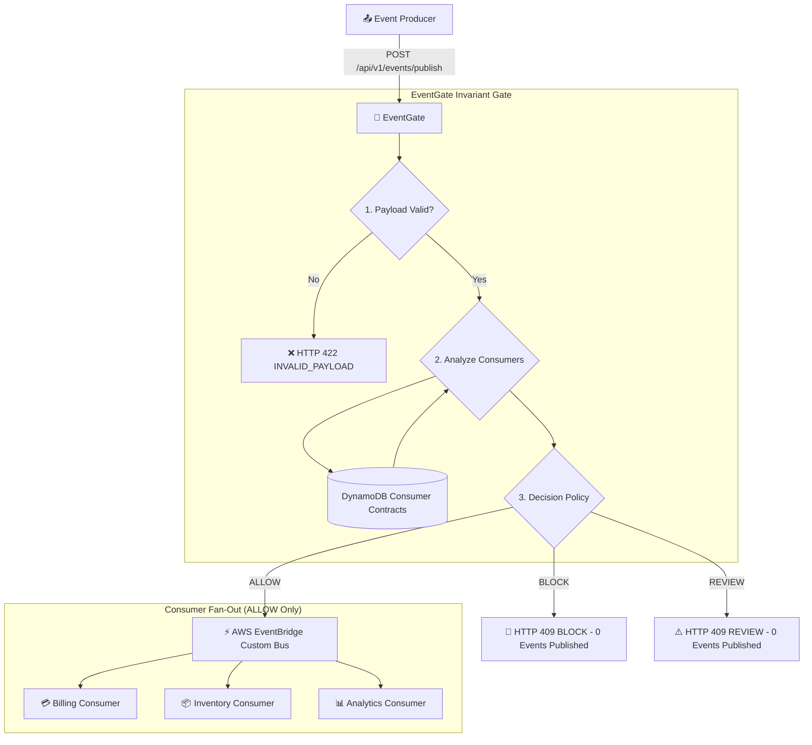

<div align="center">

# 🚪 PrimeX EventGate

### Consumer-Aware Safety Gate & Cloud Enforcement for Event-Driven Systems

*Stop breaking changes before they ever reach the event bus.*

[](https://www.python.org/)
[](https://fastapi.tiangolo.com/)
[](https://aws.amazon.com/serverless/sam/)
[](https://aws.amazon.com/eventbridge/)
[](https://aws.amazon.com/dynamodb/)
[]()
[]()
[](LICENSE)
[]()

</div>

---

EventGate intercepts **event publishing** and **schema changes** in event-driven architectures, deterministically predicting **downstream consumer impact** and **enforcing safety in the cloud**. Instead of blindly publishing to an event bus or relying only on producer-side schema registries, EventGate evaluates every event and schema transition against **registered downstream consumer contracts**:

- ✅ **`ALLOW`**: The change is safe for all consumers $\to$ Event published to Amazon EventBridge $\to$ Fans out to subscribed consumer Lambdas.
- 🚫 **`BLOCK`**: A downstream consumer would break $\to$ Gateway returns HTTP 409 Conflict $\to$ **Zero events sent to EventBridge** (downstream consumers never invoked).
- ⚠️ **`REVIEW`**: An uncertain or risky change is detected $\to$ Gateway returns HTTP 409 Conflict $\to$ **Zero events sent to EventBridge** pending human sign-off.

<div align="center">



</div>

---

## 📚 Table of Contents

- [Evolution: Phase 1 $\to$ Phase 3](#-evolution-phase-1--phase-3)
- [Architecture & Directory Structure](#️-architecture--directory-structure)
- [Live Cloud Deployment (AWS ap-south-1)](#-live-cloud-deployment-aws-ap-south-1)
- [API & Cloud Enforcement Endpoints](#-api--cloud-enforcement-endpoints)
- [Golden Test Scenarios & Verification](#-golden-test-scenarios--verification)
- [Getting Started (Local Development)](#-getting-started-local-development)
- [License](#-license)

---

## 🧭 Evolution: Phase 1 $\to$ Phase 3

| Phase | Focus | Architectural Milestone |
|---|---|---|
| **🧱 Phase 1 — Foundation + Engine** | Deterministic Core | Pure domain compatibility engine · ChangeSet differ · Consumer contract scoping · Three-tier decision policy (`ALLOW` / `REVIEW` / `BLOCK`) · Local FastAPI ASGI · JSON-file contract fixtures |
| **☁️ Phase 2 — Serverless AWS Runtime** | Cloud Persistence | AWS SAM infrastructure · Lambda (Python 3.14) via Mangum ASGI adapter · Amazon API Gateway HTTP API · DynamoDB persistence (`EventContractsTable` & `ConsumerContractsTable`) · Dual-mode storage (`local` ↔ `dynamodb`) · Zero-scan query access patterns |
| **⚡ Phase 3 — Enforcement & Fan-Out** | Real Cloud Enforcement | Amazon EventBridge custom event bus (`primex-eventgate-dev-bus`) · Two-phase payload-first validation · EventBridge event publishing adapter (`EventBridgeEventPublisher`) · Consumer demonstration Lambdas (`Billing`, `Inventory`, `Analytics`) · Fail-closed gate preventing downstream propagation on `BLOCK`/`REVIEW` |

---

## 🏗️ Architecture & Directory Structure

Built on **Clean Architecture** principles — the domain engine remains pure Python with zero I/O, wrapped by serverless adapters.

```text
primex-eventgate/
├── backend/
│   ├── src/
│   │   ├── eventgate/
│   │   │   ├── api/                      # Presentation layer (FastAPI routers, DTO schemas)
│   │   │   │   ├── routes/               # Health, analysis, and event publishing endpoints
│   │   │   │   ├── dependencies.py       # Dual-storage & publisher dependency injection
│   │   │   │   └── errors.py             # Stable structured error response handlers
│   │   │   ├── application/              # Orchestration layer
│   │   │   │   ├── ports/                # Repository & publisher interface protocols
│   │   │   │   └── services/             # EventAnalysisService & EventPublishService
│   │   │   ├── domain/                   # Pure business logic (zero I/O, cloud-agnostic)
│   │   │   │   ├── changes.py            # ChangeSet computation
│   │   │   │   ├── compatibility.py      # Field-level & consumer-level rules engine
│   │   │   │   ├── decision.py           # Aggregate decision policy
│   │   │   │   ├── payload_validator.py  # Strict payload validation against schema
│   │   │   │   ├── enums.py              # StrEnum status definitions
│   │   │   │   ├── errors.py             # Domain exception types
│   │   │   │   └── models.py             # Pure immutable dataclasses
│   │   │   ├── infrastructure/           # Persistence & messaging adapters
│   │   │   │   ├── publishers/           # Local in-memory sink & AWS EventBridge publisher
│   │   │   │   └── repositories/         # Local JSON & DynamoDB repository adapters
│   │   │   ├── config/                   # Application settings & environment config
│   │   │   ├── lambda_handler.py         # Mangum ASGI adapter for AWS Lambda
│   │   │   └── main.py                   # FastAPI ASGI entrypoint
│   │   └── requirements.txt              # Lambda runtime dependencies for SAM packaging
│   └── tests/
│       ├── unit/                         # Unit tests (engine, models, publishers, validators)
│       └── integration/                  # End-to-end API, publishing, and Lambda integration tests
├── consumers/                            # Consumer demonstration services
│   └── src/
│       └── consumer_handler.py           # Lightweight Python 3.14 consumer event logger
├── contracts/                            # Versioned canonical contract fixtures
│   ├── events/order-placed/              # v1, v2-safe, v3-breaking, v4-risk
│   └── consumers/                        # billing, inventory, analytics consumer contracts
├── docs/                                 # Architectural & deployment specifications
│   ├── api.md                            # Comprehensive API documentation & cURL examples
│   ├── enforcement.md                    # Gated publishing pipeline & fail-closed invariants
│   ├── eventbridge-architecture.md       # EventBridge bus, rules, fan-out & IAM policies
│   ├── aws-architecture.md               # Phase 2 AWS serverless topology & DynamoDB model
│   └── deployment.md                     # Step-by-step deployment guide
├── scripts/
│   ├── seed_dynamodb.py                  # Idempotent DynamoDB seeding script
│   ├── aws_smoke_test.py                 # Analysis endpoint smoke test
│   └── aws_enforcement_smoke_test.py     # End-to-end cloud enforcement & absence verification
├── template.yaml                         # AWS SAM CloudFormation template (Bus, Lambdas, Tables)
├── samconfig.toml                        # Non-secret SAM deployment configuration
└── pyproject.toml                        # Build configuration, Ruff, Pytest & coverage settings
```

---

## ☁️ Live Cloud Deployment (AWS `ap-south-1`)

The stack is deployed and operational in AWS region **`ap-south-1`**:

| Component | AWS Resource | Physical Name / ARN |
| :--- | :--- | :--- |
| **API Gateway** | HTTP API v2 | `https://ux8bwi3i8l.execute-api.ap-south-1.amazonaws.com` |
| **Core API Lambda** | Serverless Function | `primex-eventgate-dev-api` |
| **Custom EventBus** | EventBridge Bus | `primex-eventgate-dev-bus` |
| **Event Routing Rule** | EventBridge Rule | `primex-eventgate-dev-order-placed-rule` |
| **Billing Consumer** | Lambda (128MB) | `primex-eventgate-dev-consumer-billing` |
| **Inventory Consumer** | Lambda (128MB) | `primex-eventgate-dev-consumer-inventory` |
| **Analytics Consumer** | Lambda (128MB) | `primex-eventgate-dev-consumer-analytics` |
| **Event Contracts** | DynamoDB (On-Demand) | `primex-eventgate-dev-event-contracts` |
| **Consumer Contracts** | DynamoDB (On-Demand) | `primex-eventgate-dev-consumer-contracts` |

---

## 🔌 API & Cloud Enforcement Endpoints

Full API documentation available in [`docs/api.md`](docs/api.md).

### 1. Publish Event with Gated Cloud Enforcement
```bash
POST /api/v1/events/publish
```
**Request Body:**
```json
{
  "eventType": "OrderPlaced",
  "currentVersion": 1,
  "proposedVersion": 2,
  "event": {
    "orderId": "ord-101",
    "customerId": "cust-202",
    "totalAmount": 149.99,
    "items": [{"sku": "ITEM-A", "quantity": 2, "price": 49.99}],
    "shippingMethod": "standard",
    "metadata": {"source": "web-checkout"}
  }
}
```

**Responses:**
- `200 OK`: `published: true` $\to$ `eventBridgeEventId` returned $\to$ 3 consumers receive event.
- `409 Conflict`: `published: false` $\to$ Decision is `BLOCK` or `REVIEW` $\to$ 0 events sent to EventBridge.
- `422 Unprocessable Entity`: `INVALID_EVENT_PAYLOAD` $\to$ Payload fails contract schema.

### 2. Pure Compatibility Analysis (Advisory)
```bash
POST /api/v1/analyze
```
Evaluates compatibility without publishing to EventBridge.

### 3. Health Check
```bash
GET /health
```

---

## 🧪 Golden Test Scenarios & Verification

| Scenario | Transition | Key Change | Decision | Severity | HTTP Status | EventBridge Action | Consumer Invocations |
|---|---|---|:---:|:---:|:---:|:---:|:---:|
| **A (Safe)** | v1 $\to$ v2 | Added optional `metadata` | ✅ `ALLOW` | 🟢 `LOW` | `200 OK` | `PutEvents` executed | **3 Received** (Billing, Inventory, Analytics) |
| **B (Breaking)** | v1 $\to$ v3 | `shippingMethod` changed to `object` | 🚫 `BLOCK` | 🔴 `HIGH` | `409 Conflict` | **Prevented** | **0 Received** (Downstream protected) |
| **C (Risk)** | v1 $\to$ v4 | Removed optional `couponCode` | ⚠️ `REVIEW` | 🟡 `MEDIUM` | `409 Conflict` | **Prevented** | **0 Received** (Downstream protected) |
| **Payload Fail** | v2 malformed | Missing required `orderId` | — | — | `422 Unproc` | **Bypassed** | **0 Received** |

### Run Live AWS Enforcement Verification

```powershell
python scripts/aws_enforcement_smoke_test.py https://ux8bwi3i8l.execute-api.ap-south-1.amazonaws.com
```

**Verification Guarantees Tested:**
1. ✅ Discovers consumer Lambda function names and log groups dynamically from CloudFormation stack outputs.
2. ✅ Confirms `ALLOW` publishes to EventBridge and logs are recorded in Billing, Inventory, and Analytics CloudWatch streams.
3. ✅ Confirms `BLOCK` and `REVIEW` return HTTP 409 and actively polls consumer log groups to prove **complete absence** of the event.
4. ✅ Confirms invalid payloads return HTTP 422 before reaching the analysis engine or event bus.

---

## 🚀 Getting Started (Local Development)

```powershell
# 1. Activate environment
.\.venv\Scripts\Activate.ps1

# 2. Run test suite & coverage (190 tests, 94.08% coverage)
pytest --cov=eventgate --cov-report=term-missing

# 3. Lint and format checks
ruff check .
ruff format --check .

# 4. Run SAM template validation and build
sam validate --lint
sam build
```

---

## 📄 License

This project is licensed under the **MIT License** — see the [LICENSE](LICENSE) file for details.

<div align="center">

---

*Built for the AWS "First Commit" hackathon — Bharat Builds Tour by WeMakeDevs* 🇮🇳

</div>
